# 1. Introduction

**Team Leader:** Yelena Shabanova (320991)  
**Team Members:** Alena Seliutina (323591), Luis Fernando Henriquez Patino (314661)

In this project, we explored the Audience Decode dataset using unsupervised machine learning techniques. The dataset contains detailed rating histories for each user, summary statistics for both users and movies, and additional movie-level attributes. Our goal was to identify meaningful groups of users, detect unusual behavioral patterns, and compare how different clustering algorithms perform on high-dimensional, noisy data.

We started by performing an exploratory data analysis (EDA) on both users and movies. This helped us better understand rating distributions, activity patterns, and relationships between features. Before clustering the users, we first applied clustering to the movie dataset to create pseudo-genres. They later helped us interpret user preferences.

Next, we clustered the users using three methods: K-Means, DBSCAN, and BIRCH. Each model has different strengths, but after comparing the results, we chose K-Means as our main model because it produced the clearest and most stable clusters. These user clusters represent different types of audience behavior and allow us to estimate their pseudo-genre preferences.

Finally, we looked at how these preferences changed over time to understand how audience behavior evolves. Overall, our project shows how unsupervised learning can help discover hidden patterns in user interactions and provide insights into audience segmentation.

---

# 2. Methods

After managing the libraries and loading all data by connecting to the `viewer_interactions.db`, we load the key tables into pandas DataFrames. We got:

- `user_statistics`: Pre-computed behavioral data, serving as the main features for each user.  
- `movie_statistics`: Pre-computed statistical data for each movie.  
- `movies`: Essential metadata for movies, including the title and year of release.

Then we started from exploratory data analysis, continuing through preprocessing and clustering, and ending with model selection. Below, we describe each methodological step, along with the tools used and the outputs obtained. All figures referenced in this section are placed in an additional folder named `images/`, which accompanies the README.

---

# 3. Exploratory Data Analysis (EDA)

We must have understood the model behaviour. Therefore, we performed an EDA to analyze the distributions of our data. For this part we mainly used `pandas`, `numpy`, `matplotlib`, and `seaborn`, as well as `sqlite3` to extract data from the original database.

## 3.1 User EDA

In this section, using `user_statistics`, our goal was to understand viewer activity patterns and the distributions of key behavioral features. Then we were able to cluster users based on shared patterns. We examined distributions of:

- total number of ratings per user  
- users’ average rating  
- standard deviation of ratings  
- activity levels  

We showed that on visualizations (Figures U1–U7).

First, we displayed a summary table of the main user-level metrics (Figure U1). This table provides an overview of how users behave on the platform in terms of activity and rating style.

**Figure U1 – User statistics summary**  
[images/user_statistics_summary.csv](images/user_statistics_summary.csv)

**Interpretation (U1):**

- `total_ratings` is highly right-skewed: most users rate only a few titles, while a small minority rate dozens or hundreds.  
- `avg_rating` varies widely across users, indicating different rating styles (harsh vs. generous raters).  
- `std_rating` shows how consistent a user is in their scoring behavior.  
- `unique_movies` closely mirrors `total_ratings`, showing that users rarely re-rate the same film.  
- `activity_days` captures long-term engagement over time.

Next, we plotted a histogram of `total_ratings` (Figure U2) to understand how active users are. This plot shows that user activity is extremely imbalanced, with a large passive group and a small highly active group. Activity becomes a key dimension for clustering.

**Figure U2 – Histogram of total ratings per user**  
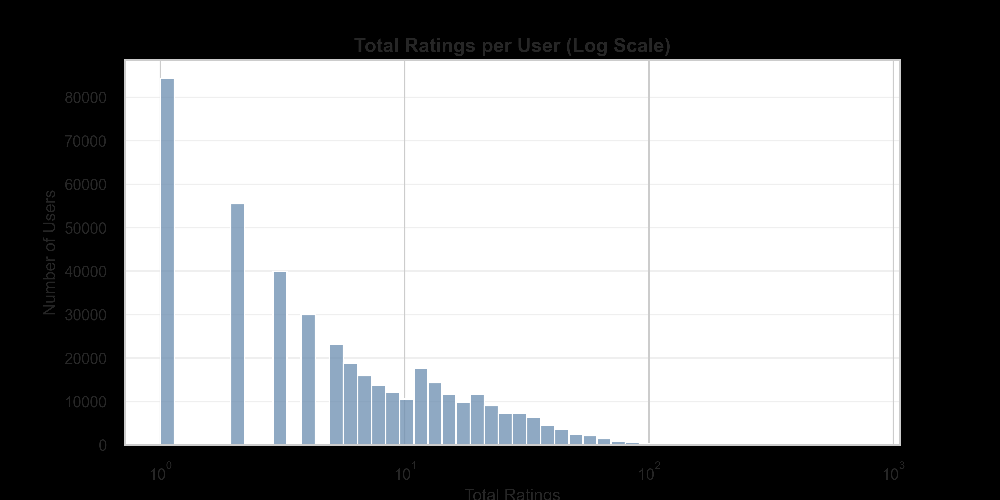

**Interpretation (U2):**

- Most users rate very few movies: the majority give between 1 and 5 ratings.  
- Around 75% of users rate fewer than 11 movies, showing a large group of low-activity users.  
- Moderately active users (20–50 ratings) form a smaller but visible segment.  
- There is a long tail of “power users” with 100+ ratings, but they are rare.

Then we looked at the distribution of users’ average rating using a histogram (U3) and a violin plot (U4). Together, these plots show that rating style (how generous or harsh a user is) is another important behavioral dimension we need to capture.

**Figure U3 – Histogram of average user rating**  
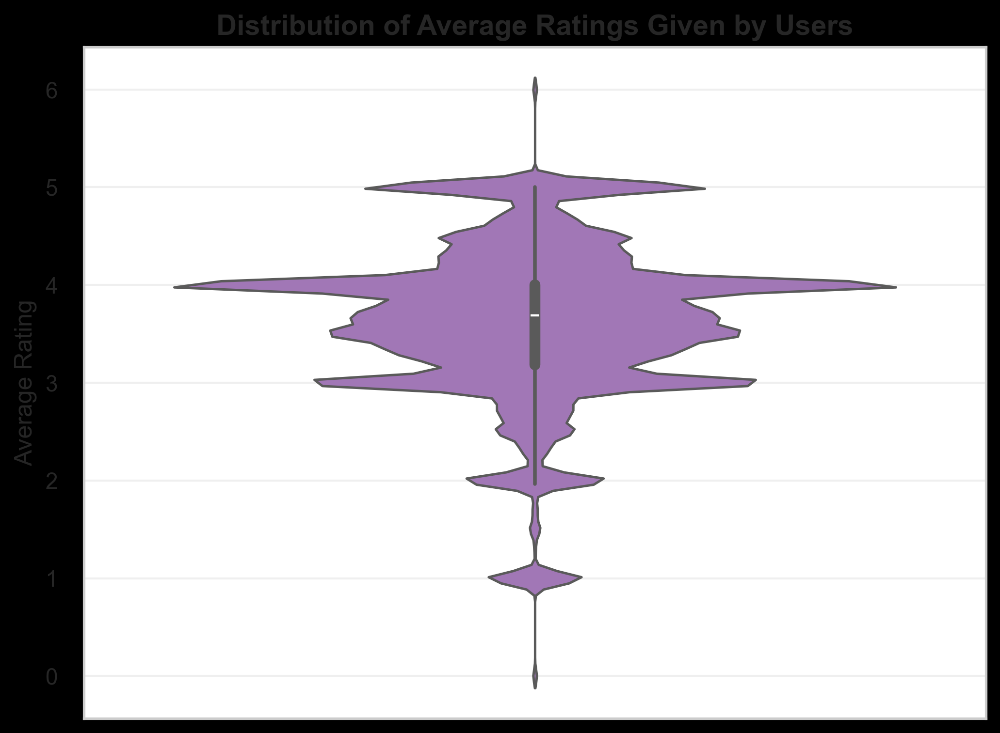

**Histogram interpretation (U3):**

- Most users have an average rating between 3.0 and 4.0, showing a general positive bias.  
- There are visible spikes at integer values, as ratings are discrete (1–5).  
- Some users systematically give low or high scores, meaning rating style varies across the population.

**Figure U4 – Violin plot of average user rating**  

**Violin plot interpretation (U4):**

- The densest region is around 3.5–4.0, confirming most users tend to rate positively.  
- Thin tails at the extremes indicate small groups of consistently harsh or consistently generous users.  
- The distribution is not perfectly symmetric, and its shape suggests substantial variation in rating style.

To study how activity influences consistency, we grouped users into activity quartiles based on `total_ratings` and compared their rating behavior (Figure U5). This shows that more active users tend to be more consistent in their ratings. Activity level, therefore, is not only about how much users watch but also about how stable their rating behavior is (again supporting its use as a key feature for clustering).

**Figure U5 – Rating behaviour by activity level**  
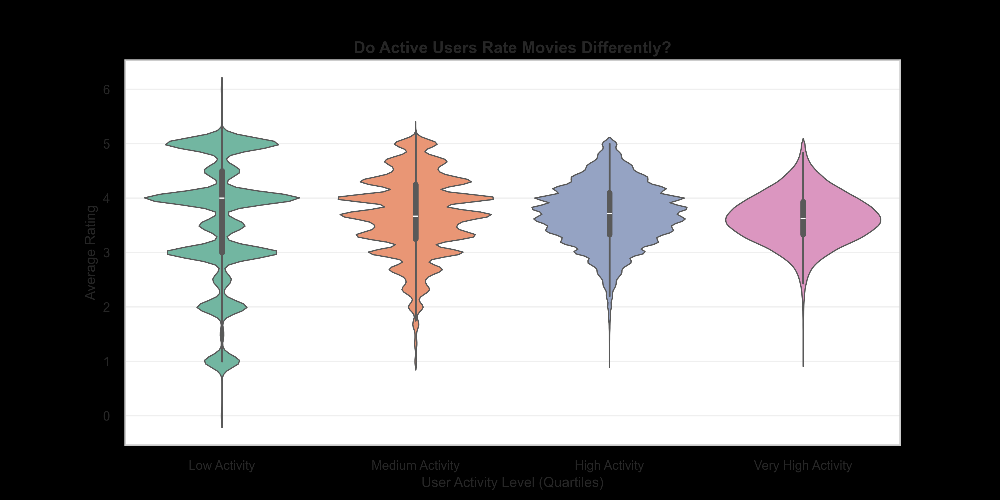

**Interpretation (U5):**

- Mean ratings stay pretty similar across activity levels, so activity does not significantly change the average score.  
- Low-activity users show very wide variation in average ratings, including many extreme values.  
- Medium and high-activity users are more concentrated around the 3–4 range.  
- Very high-activity users show the narrowest spread, indicating the most stable rating behavior.

Then, we plotted a scatterplot of `unique_movies` vs `total_ratings` using a sample of users (Figure U6) to check for redundancy between these features. As these features are so tightly correlated, we can treat them as essentially encoding the same information. This is important when deciding which variables to keep in the feature matrix.

**Figure U6 – Unique movies vs total ratings**  
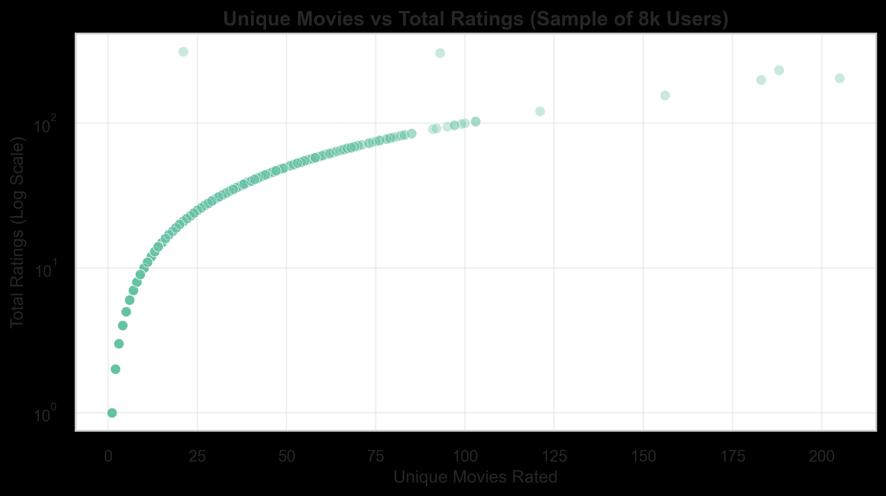

**Interpretation (U6):**

- Points lie very close to a curved line, indicating a near-linear relationship between `unique_movies` and `total_ratings`.  
- This confirms that users almost never re-rate the same movie.  
- The log-scaled axis reveals both low-activity and high-activity users in the same plot.

Finally, we created a correlation heatmap of the main user features (Figure U7). From it we concluded that we should avoid including redundant features in the clustering (`total_ratings` and `unique_movies`), and combine activity, consistency, and rating style features to best capture different user personas.

**Figure U7 – Correlation heatmap of user features**  
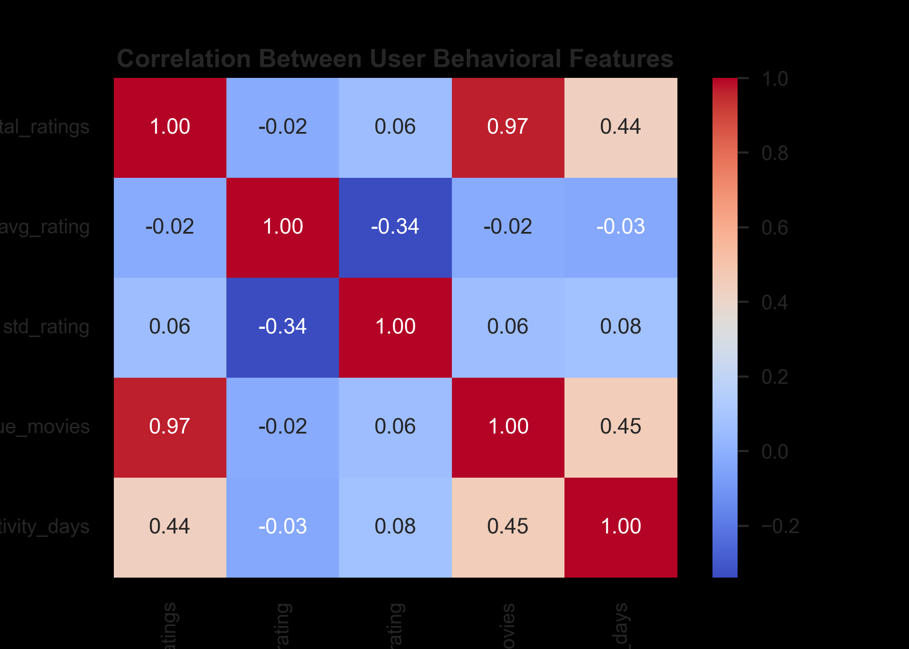

**Interpretation (U7):**

- Strong correlations appear between activity-related features (`total_ratings` and `unique_movies`).  
- Other features (such as `avg_rating` and `std_rating`) provide additional, less correlated information about rating style and consistency.

All these steps in User EDA represented our later feature selection and clustering design: we decided to focus on a compact set of user features that represent activity, rating style, and rating consistency, while avoiding redundant variables.

All figures U1–U7 mentioned above are stored in the `images/` folder and referenced from the README.

---

## 3.2 Movie EDA

To understand the behavior of movies in the platform and prepare for later movie clustering, we analyzed the `movie_statistics` and `movies` tables. Similar to the user-side EDA, the goal was to understand distribution patterns, find meaningful content-related features and find relationships that could affect clustering performance.

We again used `sqlite3` to retrieve the data and `pandas`, `numpy`, `matplotlib`, and `seaborn` for the visual analysis.

We did it through average movie ratings, rating count (popularity), rating variability, relationship between popularity and rating, distribution of release years and correlation between movie-level features.

We began with analyzing a table of aggregated movie-level statistics (Figure M1). This table already suggests that movies differ strongly across multiple dimensions, which justifies clustering them into data-driven pseudo-genres.

**Figure M1 – Movie statistics summary**  
[images/movie_statistics_summary.csv](images/movie_statistics_summary.csv)

**Interpretation (M1):**

- `avg_rating` ranges widely, showing films receive both very high and very low evaluations.  
- `rating_count` varies drastically, indicating that some movies are rated frequently while others receive very few ratings.  
- `std_rating` captures controversial films (high variance) vs. consistently liked/disliked movies.  
- `year_of_release` spans many decades, meaning the dataset mixes both old and modern titles.

Then, we looked at `rating_count` using a histogram (Figure M2). The goal here was to understand how often movies are rated and whether popularity can help separate different types of films. Popularity ends up being a key dimension for clustering, because it distinguishes extremely niche titles from mid-popular movies and true blockbusters.

**Figure M2 – Movie popularity distribution**  
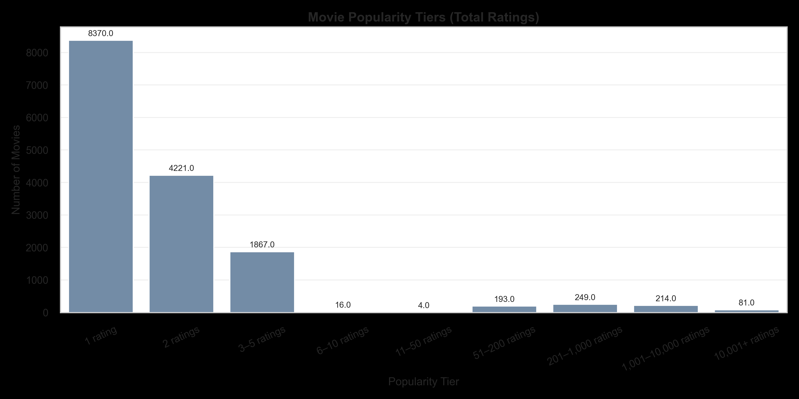

It showed that popularity is heavily skewed. Most movies have only 1–2 ratings, which already covers the majority of the catalog. After that, the numbers drop sharply: only a small number of movies reach the 6–50 ratings range, showing that mid-popular films are rare.

Popularity rises again only for a very small group of well-known titles. A few hundred movies fall into the 51–1,000 ratings tiers, around two hundred movies reach the 1,000–10,000 ratings range, and only about 80 blockbusters exceed 10,000 ratings, with the most popular title having 173,598 ratings.

This long-tail structure makes it clear why `rating_count` is essential for clustering. It helps us separate almost unseen films, moderately known films, and widely recognized blockbusters. Including popularity ensures that pseudo-genres reflect not only content characteristics but also how widely each film is viewed.

Next, we plotted a histogram of the average movie ratings (Figure M3) to see how movies are generally rated. This helped us see how movies are rated in general and whether this feature separates different types of films.

**Figure M3 – Average movie rating distribution**  

The distribution is slightly right-skewed: most movies have an average rating between 2.5 and 4.0, while very low-rated movies (below 1.5) or high-rated (above 4.5) exist but are rare. Peaks at integer values occur because movies with very few ratings often have an average equal to their single rating. The range of values is wide enough to show real differences in movie quality, so `avg_rating` is a useful feature for clustering.

To understand how controversial movies are, we looked at the distribution of `std_rating` (Figure M4). This feature helps understand which are stable favorites and which are divisive films.

**Figure M4 – Movie rating variability distribution**  
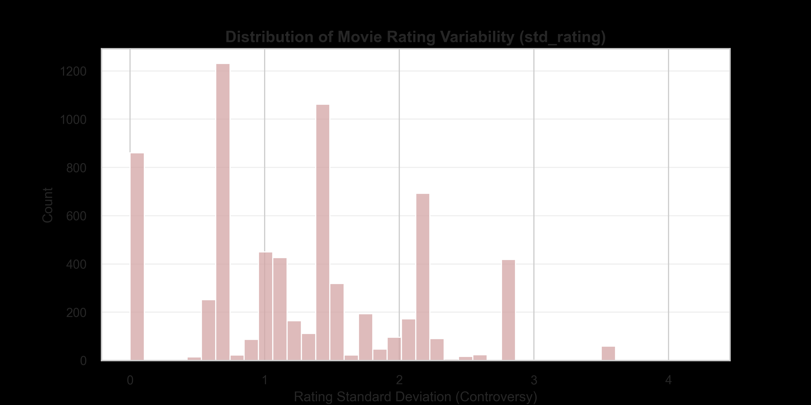

Most movies have a standard deviation around 0.7–1.3, meaning moderate disagreement. A small group has very high variability (>1.2), which suggests controversial or polarizing films. Some movies have very low variability, meaning viewers rate them almost the same way. This confirms that `std_rating` adds important information about how consistent or inconsistent movie ratings are.

We plotted `avg_rating` vs `rating_count` (Figure M5) to understand the relationship between quality and popularity.

**Figure M5 – Popularity vs average rating**  
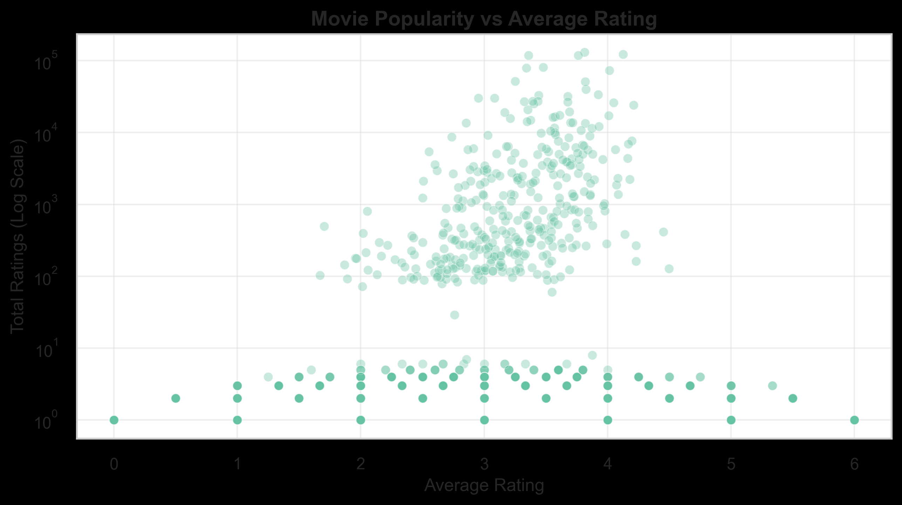

We found that very popular movies usually have moderately high ratings, and movies with very low ratings almost never become popular. At the same time, low-popularity movies show a wide range of average ratings – typical for niche films. Because the relationship is not purely linear, both features put unique information to clustering.

Next we plotted `std_rating` vs `rating_count` (Figure M6). It shows how rating variability relates to popularity.

**Figure M6 – Rating variability vs popularity**  
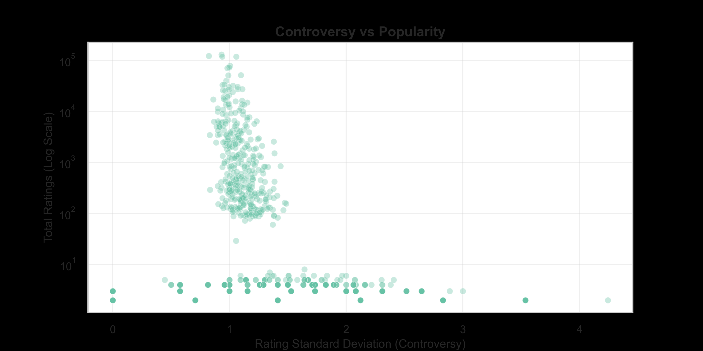

It could be seen that highly popular movies usually have lower variance, meaning people generally agree about them. Also movies with high `std_rating` tend to be less popular, therefore controversial films are often niche. Moreover, some unpopular movies show extremely high disagreement, indicating unstable reception. This confirms that popularity and controversy describe different movie behaviors, and both matter for clustering.

Finally, we computed a correlation matrix (Figure M7) for key movie features. Selected features (quality, popularity, variability, and release year) together represent meaningful axes of movie behavior and should all be kept for clustering.

**Figure M7 – Correlation heatmap of movie features**  
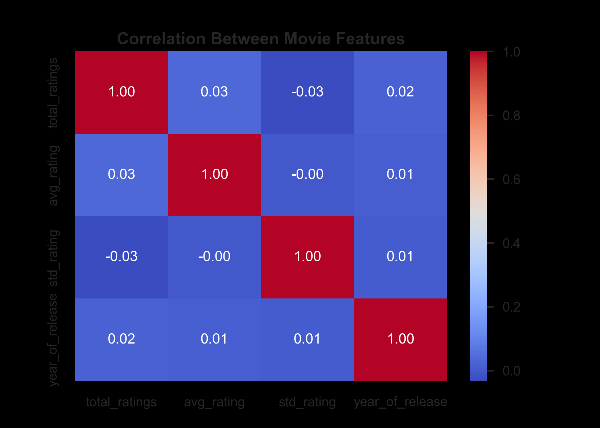

**Interpretation (M7):**

- `rating_count` has moderate correlation with `std_rating` and weak correlation with `avg_rating`, meaning popularity is not simply tied to quality.  
- `avg_rating` and `std_rating` are only weakly related, indicating both provide distinct information.  
- `year_of_release` has almost no correlation with the other features, meaning movie age adds its own independent information.

We concluded that movies differ a lot in quality, popularity, variability, and age, so grouping them into pseudo-genres makes sense. Overall, movies differ clearly in how well they are rated, how many people rate them, how consistent those ratings are, and how old they are. Because of this, clustering them into pseudo-genres is a reasonable next step before analyzing user preferences.

All figures M1–M7 are stored in the `images/` folder and referenced in the README.

---

# 4. Preprocessing and Feature Engineering

After completing the EDA, we prepared both user and movie data for clustering. Since our methods (KMeans, DBSCAN, BIRCH) are distance-based, they require a consistent set of numeric features, no missing values and features on comparable scales. To achieve this, we built two standardized feature matrices:

- `X_users_kmeans` – standardized user-level behavioral features  
- `X_movies_kmeans` – standardized movie-level features  

These matrices are the direct input to the clustering models used in Sections 5 and 6.

## 4.1 User Feature Matrix

From the User EDA, we saw that viewers differ mainly in:

- Activity level  
- Average rating style (harsh vs. generous)  
- Consistency of ratings  
- Duration of engagement  

Accordingly, we built the user feature matrix from the following variables taken from `user_statistics`:

- `total_ratings` – total number of ratings per user  
- `unique_movies` – number of distinct movies rated  
- `avg_rating` – user’s mean rating  
- `std_rating` – standard deviation of ratings (rating consistency)  
- `activity_days` – span of user activity in days  

We first extracted these columns into a dedicated DataFrame and inspected missing values. Most missingness came from structural reasons (`std_rating` undefined when a user rated only one movie or partial activity information for very sparse users). We then imputed missing values using a median imputer and standardized all features using `StandardScaler`, so each column has mean 0 and unit variance.

This produced the final user feature matrix `X_users_kmeans`, which contains one standardized behavioral vector per user and no missing values. Although `total_ratings` and `unique_movies` are highly correlated (as shown in the User EDA), we kept both during preprocessing to maintain consistency with earlier steps and let later clustering design decide on redundancy.

## 4.2 Movie Feature Matrix

On the movie side, EDA showed that films differ along four main dimensions:

- Popularity  
- Perceived quality  
- Controversiality / rating variability  
- Age (release year)  

We therefore built the movie feature matrix from:

- `total_ratings` – number of ratings per movie (popularity)  
- `avg_rating` – mean movie rating (quality)  
- `std_rating` – variability of ratings (controversial vs. consistently rated)  
- `year_of_release` – movie age  

These columns were extracted from `movie_statistics` and `movies` into a separate DataFrame. Missing values followed clear patterns: movies with no interactions lacked `total_ratings` and `avg_rating`. Movies with a single rating lacked `std_rating`. Some movies had missing `year_of_release` due to incomplete metadata.

As with users, we imputed all missing values with the median for each feature. Then, we standardized all columns with `StandardScaler`, ensuring that variables like `total_ratings` (potentially very large) do not dominate smaller-scale variables such as `avg_rating`.

The result is the movie feature matrix `X_movies_kmeans`, a clean, fully numeric and standardized representation of every movie used in the clustering methods of Section 5.

## 4.3 Summary of Preprocessing Decisions

We came to several conclusions across both users and movies:

- Missing values were systematic, not accidental: no ratings then no `avg_rating` / `total_ratings`; single rating then missing `std_rating`; incomplete metadata then missing `year_of_release`.  
- Because of this structure, we applied median imputation, which is stable for skewed distributions and fits well with KMeans.  
- No rows were removed: all users and movies are retained after preprocessing.  
- After imputation and scaling, both feature matrices contain zero missing values.  

We got final matrices ready for clustering: `X_users_kmeans` and `X_movies_kmeans`. In both matrices, missing values in features like `std_rating` were replaced using the median and all features were scaled to mean 0 and unit variance. These matrices were then prepared for use in Section 5 (Movie Clustering) and Section 6 (User Clustering).

---

# 5. Movie Clustering (Pseudo-Genre Discovery)

Before clustering users, we first clustered movies into pseudo-genres, since user interpretation later depends on movie grouping. For this section, we used scikit-learn’s KMeans and PCA for visualization.

To identify behavior-based categories of movies, we applied unsupervised clustering to the standardized movie feature matrix constructed earlier. This analysis is entirely driven by user interaction patterns, not by data such as plot or genre. For this section we used scikit-learn’s KMeans and PCA for visualization.

The movie feature matrix included many behavioral attributes such as:

- Popularity: `total_ratings`  
- Perceived quality: `avg_rating`  
- Rating inconsistency: `std_rating`  
- Age of the film: `year_of_release`  

After standardization, these variables form the input for clustering.

## 5.1 Determining Number of Clusters

We evaluated several values of k using: the Elbow Method (Figure MC1), Silhouette Scores (Figure MC2). Both evaluation criteria suggested k = 6 as a reasonable choice, balancing compactness and interpretability.

**Figure MC1 – Movie KMeans elbow (inertia)**  
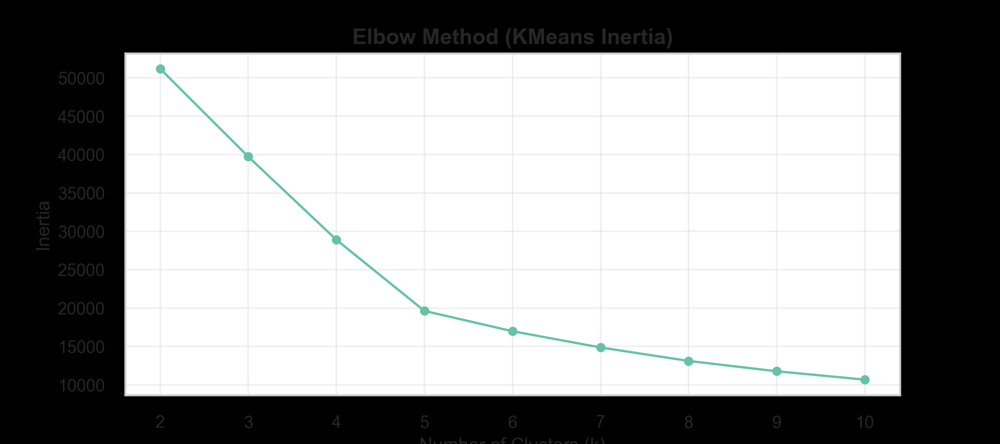

**Figure MC2 – Movie KMeans silhouette scores**  

We evaluated the number of clusters k using two standard methods:

1. **Elbow Method (Inertia):**  
   Inertia decreases rapidly for low k and begins flattening around k = 6.

2. **Silhouette Score:**  
   Measures how distinct and well-separated clusters are. Silhouette scores were highest for k = 6 within the range tested (k = 2–10).

In the end both diagnostics supported our decision to choose k = 6 as number of clusters, because it balances:

- cluster separation,  
- stability,  
- and interpretability of results.

## 5.2 Training and PCA Visualization

We selected k = 6 as the optimal number of movie clusters based on earlier evaluation. A K-Means model was then initialized with this value and trained on the standardized movie features.

During training, the algorithm learned six behavioral centroids and assigned each movie to the nearest one. The resulting cluster labels were added back to the movie DataFrame, allowing us to interpret each movie pseudo-genre and inspect whether the groups aligned with the expected rating and popularity patterns.

To visually inspect cluster separation, we reduced dimensionality to two principal components using PCA. The scatterplot (Figure MC3) displayed well-formed cluster boundaries, confirming that the chosen features were informative.

**Figure MC3 – PCA scatterplot of movie clusters**  
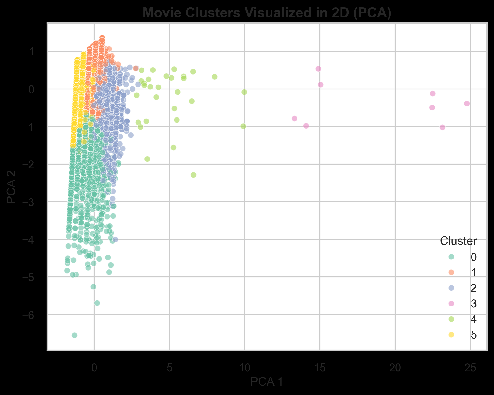

To visualize high dimensional clustering results, we applied a two component PCA. The resulting 2D scatterplot (using a sample of 8k movies for better clarity):

- Revealed well-separated regions corresponding to clusters  
- Confirmed that the chosen features carry meaningful variance for grouping movies  
- Provided visual support for k = 6 being a structurally coherent segmentation  

PCA was used strictly for visualization; clustering was performed on the standardized full feature space.

## 5.3 Interpreting the Pseudo-Genres

We summarized each movie cluster using descriptive statistics (Figure MC4) and manually interpreted their characteristics, making the final pseudo-genres:

**Figure MC4 – Movie cluster summary table**  
[images/movie_cluster_summary.csv](images/movie_cluster_summary.csv)

1. **Old Classics:** Older films with moderate engagement and moderate scores  
   - Avg Popularity: ~90 ratings  
   - Avg Rating: 3.05  
   - Rating Variability: ~1.09  
   - Mean Year: 1958  

2. **Well Liked Niche Films:** Films with small audience but very positive reception  
   - Avg Popularity: ~18 ratings  
   - Avg Rating: 4.09  
   - Rating Variability: ~0.46  
   - Mean Year: 1997  

3. **Controversial Films:** Films that divide viewers due to high variability  
   - Avg Popularity: ~202 ratings  
   - Avg Rating: 3.05  
   - Rating Variability: 1.77  
   - Mean Year: 1995  

4. **Blockbuster Hits:** Extremely high popularity with stable ratings; dominant mass-market successes  
   - Avg Popularity: ~99,310 ratings  
   - Avg Rating: 3.76  
   - Rating Variability: ~0.98  
   - Mean Year: 1996  

5. **Popular Films:** Films with strong engagement and consistent ratings  
   - Avg Popularity: ~25,233 ratings  
   - Avg Rating: 3.55  
   - Rating Variability: ~1.02  
   - Mean Year: 1992  

6. **Hated Invisible Film:** Films that were unnoticed and with almost no audience  
   - Avg Popularity: ~2.5 ratings  
   - Avg Rating: 1.48  
   - Rating Variability: ~0.55  
   - Mean Year: 1996  

---

# 3. Experimental Design

## 1. User Clustering

Once pseudo-genres were established, we clustered users based on their engagement level and rating style to uncover behavior-based viewer types.

The standardized user feature matrix included:

- Activity level: `total_ratings`, `unique_movies`, `activity_days`  
- Rating style: `avg_rating`, `std_rating`  

We evaluated multiple clustering algorithms:

- K-Means on the full user dataset  
- DBSCAN on the full standardized matrix  
- BIRCH with behaviour-weighted features  

### 1.1 K-Means: Choosing the Number of User Clusters

We applied the same methods as for movies: Elbow plot for inertia (Figure UC1); Silhouette scores.

**Figure UC1 – User KMeans elbow (inertia)**  
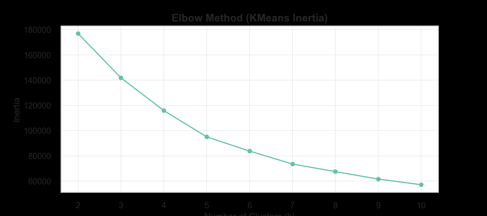

To choose the number of clusters for K-Means, we:

- Took a random sample from the standardized feature matrix: `X_users_kmeans`.  
- For each k ∈ {2,…,10} we: fit K-Means on the sample and computed the silhouette score and inertia (Elbow method).  
- Additionally, we used `KElbowVisualizer` on the full matrix to confirm elbow region.  

The silhouette score was highest at k = 2, but that solution is too rough. Among all k > 2, k = 6 achieved the best silhouette score and lay in the elbow region of the inertia curve, while also yielding richer, more interpretable segments. Therefore we selected k = 6 as the number of user clusters for K-Means.

### 1.2 KMeans: Final User Segmentation

With k = 6 fixed, we trained K-Means on the full standardized user dataset:

- **Input features:** `total_ratings`, `unique_movies`, `avg_rating`, `std_rating`, `activity_days` (all standardized)  
- **Model:** `KMeans(n_clusters=6, random_state=42, n_init=10)`  
- **Output:** each user received a cluster label  

We then:

- Computed cluster-level summaries (mean, median, count of all five features) to characterize each segment.  
- Projected users into 2D with PCA and plotted a scatterplot colored by cluster label to visually inspect separation.

**User PCA plot (KMeans clusters)**  
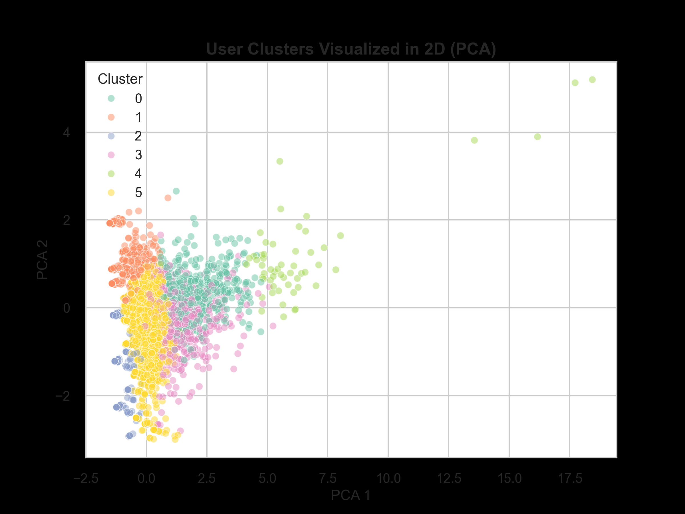

This resulted in six distinct behavioral user types, later given descriptive names. These profiles are used later to interpret engagement patterns and preferences.

### 1.3 DBSCAN Analysis

To explore density-based structure, we applied DBSCAN directly on the full standardized user matrix.

DBSCAN produced:

- One dominant cluster containing ≈ 95% of users  
- Several smaller clusters (on the order of 8k–10k users)  
- A number of tiny micro-clusters (< 300 users)  
- About 0.5% of users labeled as noise (Figure DB1)  

**Figure DB1 – DBSCAN clusters (PCA projection)**  
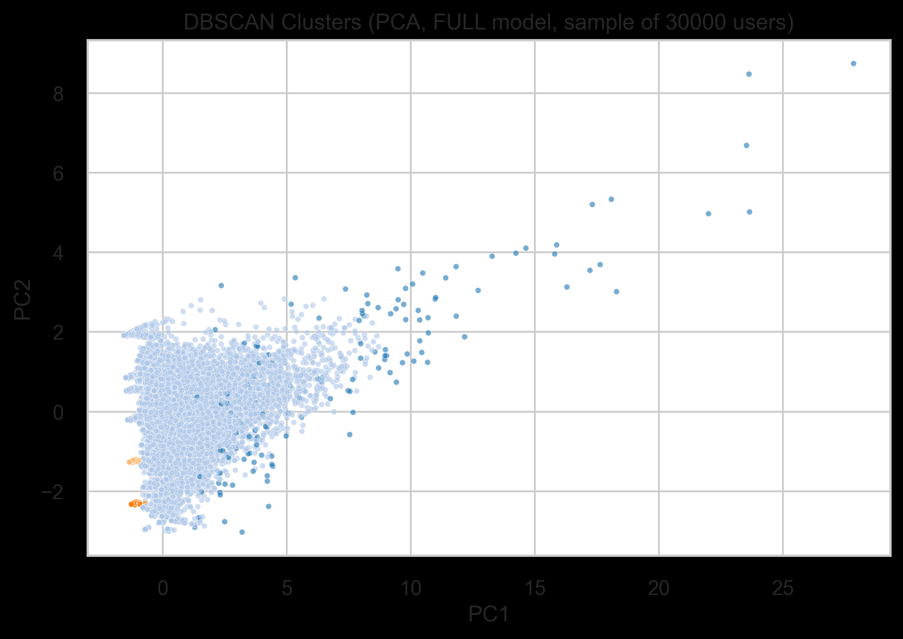

We then:

- Sampled up to 30,000 users  
- Applied PCA(2) for visualization  
- Plotted the DBSCAN labels in 2D  
- Computed a silhouette score on ~50,000 non-noise users (≈ 0.12)  

(DB2 is not shown as a figure.)

This confirmed that, although DBSCAN reveals some density-based structure, the data is dominated by a large homogeneous core, and the resulting segmentation is not as clean or interpretable as K-Means.

### 1.4 BIRCH Analysis

Considering all models, we decided to experiment with BIRCH due to how it handles big data.

**Choosing k for BIRCH:**

- Used a sample of up to 50,000 users (`X_birch_sample`) from the standardized matrix.  
- Evaluated k = 2…10 using silhouette scores.  
- While k = 2 had the highest silhouette, it collapsed almost all users into one broad cluster and isolated only heavy users, which is not very informative.  
- k = 4 offered a better trade-off between score and interpretability (Figure BCH1).

**Figure BCH1 – BIRCH silhouette scores**  
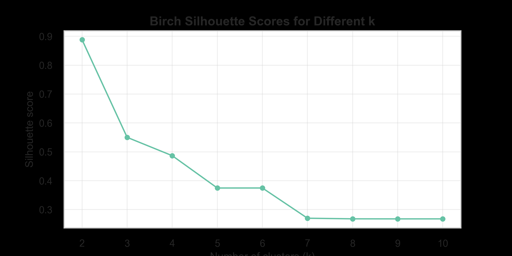

**Behaviour-weighted BIRCH:**

To focus on behavior rather than just volume, we reweighted features:

- `total_ratings`, `unique_movies` × 0.5 (down-weight volume)  
- `avg_rating`, `std_rating`, `activity_days` × 2.0 (up-weight rating style and temporal behaviour)  

On this behaviour-weighted matrix (`X_birch`), we trained:

- `Birch(n_clusters=4)` on the full dataset  
- Summarized each cluster and visualized them using PCA(2) (Figure BCH2)

**Figure BCH2 – BIRCH clusters (PCA projection)**  
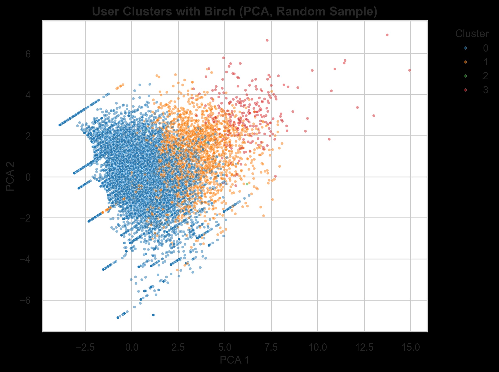

This produced four interpretable audience patterns, distinguishing casual users, explorers, irregular users, and heavy users in a more behavior-focused way than the unweighted version.

### 1.5 Evaluation of Clustering Quality

We compare these models based on silhouette score as evaluation metric. The silhouette score measures how well defined the clusters are. Score ranges from -1 to 1:

- Clusters that are dense and very far apart (the ideal) → +1  
- Clusters that overlap → 0  
- Points that are probably in the wrong cluster → -1  

**K-Means (k = 6)**  
Silhouette Score: ~0.33

K-Means performs strongly and consistently because:

- It creates balanced clusters, instead of one dominating cluster.  
- The segments are easy to interpret: engagement level, rating style, and activity duration emerge naturally.  
- It works directly on the standardized feature matrix with no need for weighting or tuning.  
- It handles the large, high-dimensional dataset efficiently.  
- The resulting clusters align well with human-interpretable behavioral categories (e.g., power users, one-time visitors).

In practice, this makes K-Means the most stable and intuitive method for segmenting users.

**DBSCAN**  
Silhouette Score: ~0.2 (computed only on non-noise users)

DBSCAN struggles with this dataset because:

- User data is very high-dimensional and DBSCAN works best in low dimensional spaces.  
- The dataset is highly uneven, with many low-activity users and few heavy users—DBSCAN treats this as one giant dense region.  

DBSCAN produces:

- One massive cluster containing ~95% of all users  
- Several tiny clusters  
- A large amount of noise (points it cannot cluster)  

This indicates poor cluster separation and shows that density-based clustering is not appropriate for this type of behavioral data. DBSCAN is helpful for understanding density structure, but not useful for producing interpretable user segments.

**BIRCH (k = 4, with behaviour-weighted features)**  
Silhouette Score: ~0.40 (highest)

BIRCH performs well after applying behavior-weighted features, producing:

- Four clear audience groups  
- Broad distinct patterns in activity, viewing diversity, and rating stability  
- A compact, well-separated cluster structure  

However, BIRCH creates broader and more general clusters, making it less detailed for behavioral segmentation compared to K-Means. It is valuable as a complementary view, but not as the main model for downstream analysis.

**Final Decision: K-Means is Selected**

Although BIRCH achieves a higher silhouette score, K-Means is chosen as the final user clustering model because:

- It creates six well-balanced, interpretable audience segments  
- Clusters reflect meaningful behavioral traits  
- It scales efficiently and requires no manual tuning  
- It provides the information needed for analyzing genre preferences and long-term engagement patterns  

Therefore, K-Means with k = 6 is selected for all final analyses, while DBSCAN and BIRCH serve as comparison models.

(An overall silhouette comparison could be summarized in `images/user_clustering_model_scores.csv` if desired.)

### 1.6 Interpreting User Clusters

After finalizing K-Means we have to reference user groups in later sections, so we assign descriptive behavioral labels. The names and parameters that were given are:

- **Cluster 0 — Consistent Enjoyers**  
  - ~29 total ratings, ~29 unique movies  
  - Positive average rating (~3.6)  
  - Activity span around 447 days (1+ year)  
  - Steady users who explore many movies and show consistent engagement (≈ 42k users)

- **Cluster 1 — Fan Visitors**  
  - ~2–3 total ratings, ~2 unique movies  
  - Very high average rating (~4.5)  
  - Short activity (mean ~64 days, median 0)  
  - Brief visitors who rate a couple of favourite movies generously and leave (≈ 101k users)

- **Cluster 2 — One-Movie Critics**  
  - ~1–2 total ratings, usually 1 unique movie  
  - Average rating ~2.3–2.5  
  - Very short activity (~30 days)  
  - Users who appear once, rate a movie or two, and do not return (≈ 49k users)

- **Cluster 3 — Loyal Occasional Enjoyers**  
  - ~14 ratings, ~12 unique movies  
  - Balanced average rating (~3.56)  
  - Very long activity (~1060 days ≈ 3 years)  
  - Loyal long-term users who come back over years but do not rate heavily (≈ 46k users)

- **Cluster 4 — Heavy Enthusiasts**  
  - ~78+ ratings, 65+ unique movies  
  - Average rating (~3.38)  
  - Long activity (~900 days)  
  - High-engagement users who explore many movies and remain active for years (≈ 6k users)

- **Cluster 5 — Short-Term Users**  
  - ~6–7 ratings, ~5 unique movies  
  - Neutral average rating (~3.5)  
  - Activity ~180 days  
  - Viewers who interact lightly and stay for only several months (≈ 170k users)

These clusters represent distinct audience types and are later used to analyze:

- How different user types consume the movie pseudo-genres  
- How engagement and rating behaviour evolve over time  
- How viewing patterns differ across segments in terms of intensity, generosity, and stability  

---

# 2. User–Movie Preferences

This section unites two major components of our project:

- **Audience Segments:** discovered through user clustering  
- **Content Groups:** groups derived from movie clustering  

To understand how different audiences engage with different types of content and how this behavior changes over time, we analyze the `viewer_ratings` interaction table, which contains over four million ratings. Because loading this table all at once would exceed available memory, the analysis is designed to extract only necessary columns and load it in chunks, allowing us to clearly observe the evaluation and efficiency of the data.

## 2.1 Merging Users and Movie Clusters

Before analyzing preferences, we combine three tables:

- `viewer_ratings` (customer_id, movie_id, rating, date)  
- user cluster labels  
- movie cluster labels  

We create simple lookup dictionaries containing a map between each user/movie and their respective cluster. Then we start iterating through the ratings table in chunks of 400k rows. For each chunk we:

- attach the audience segment and movie genre to each rating  
- extract the year the rating was made  
- store the partial summaries and yearly activities for later  

This will allow us to study which audience segments watch which pseudo-genres, and how this varies over time.

- **EXP1:** Head of merged interaction table  
- **EXP2:** Interaction distribution per (`user_cluster`, `movie_cluster`)  

(These can be stored as CSVs if desired.)

## 2.2 Building the Matrices (Section 7.2)

After merging users, movies, and interactions, the next step is to quantify how each user segment engages with each movie genre. To do this, we construct three complementary matrices that summarize viewing behavior and preferences.

**Methods Used:**

For every combination of (`user_clusters`, `movie_clusters`), we compute:

- **Rating count:** how many ratings that user group gave to that genre  
  - Reflects how much exposure each audience segment has to a given pseudo-genre.  
- **Average rating:** mean value of those ratings  
  - Reflects how positively or negatively each group reacts to that genre.  
- **Engagement share:** rating count divided by the group’s total ratings  
  - Expresses what portion of their overall viewing each genre represents. Is this user type mainstream-oriented, niche-oriented, or balanced?

**Why do these metrics matter?**

- Average rating = preference intensity  
- Count = familiarity / exposure  
- Share = viewing composition for each audience segment  

These three values together can describe what they watch, how often they watch it, and how much they like it.

**Matrices Produced:**

- **Preference Matrix (`pref_mean`)**  
  - rows: user clusters  
  - columns: movie pseudo-genres  
  - values: average rating  

  Table stored in:  
  [images/average_rating_summary.csv](images/average_rating_summary.csv)

- **Count Matrix (`pref_count`)**  
  - shows how many ratings each group gives to each genre  

  Table stored in:  
  [images/number_ratings_summary.csv](images/number_ratings_summary.csv)

- **Engagement Share Matrix (`engagement_share`)**  
  - normalizes counts to proportions, revealing dominant vs. minor genres for each audience segment  

  Table stored in:  
  [images/share_genre_in_user_segment.csv](images/share_genre_in_user_segment.csv)

**Figures**

- **EXP3: Heatmap of average ratings**  
  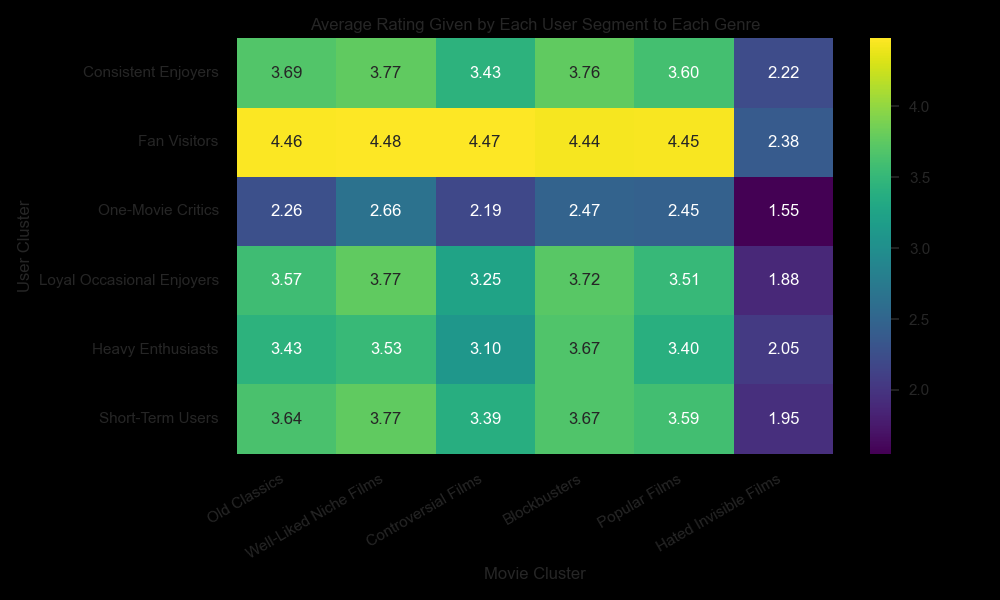

- **EXP4: Heatmap of rating frequencies / viewing share**  
  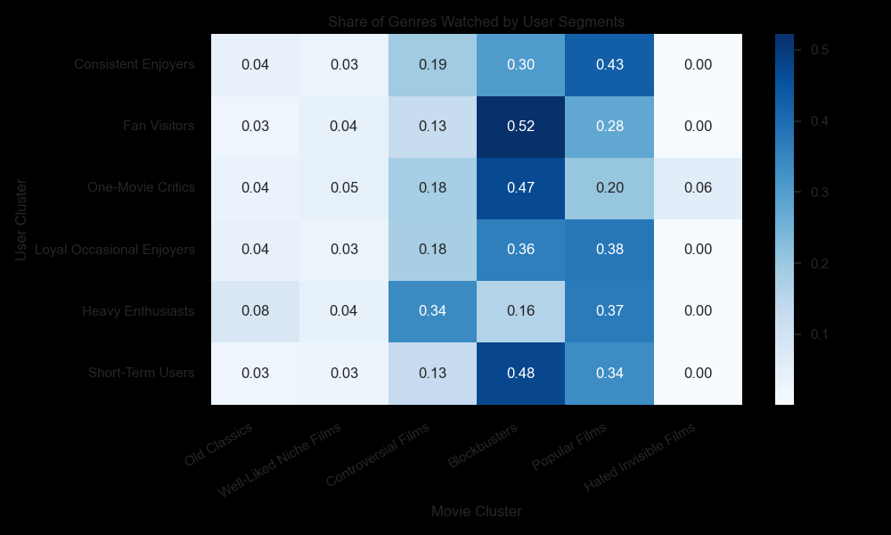

These two heatmaps form the central behavioral comparison of user clusters.

## 2.3 Temporal Analysis Design

To analyze how behavior changes over time, timestamps in `viewer_ratings` are converted to years.

For each year, we compute:

- number of ratings given by each user cluster  
- number of ratings received by each movie pseudo-genre  

We then convert these into yearly shares, which allows clusters and genres to be compared even when overall platform activity changes.

**Figures:**

- **EXP5: User cluster activity over time**  
  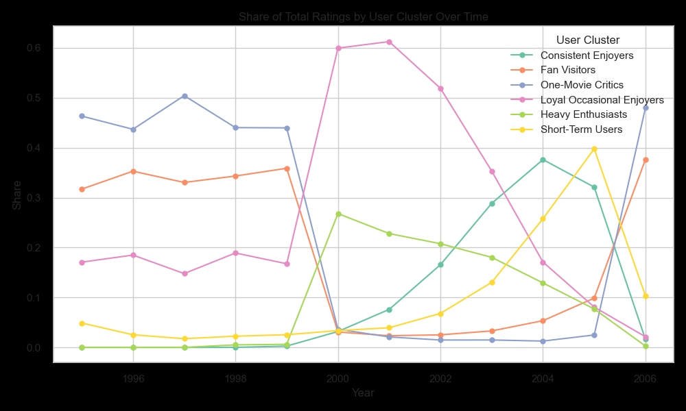

- **EXP6: Movie cluster popularity over time**  
  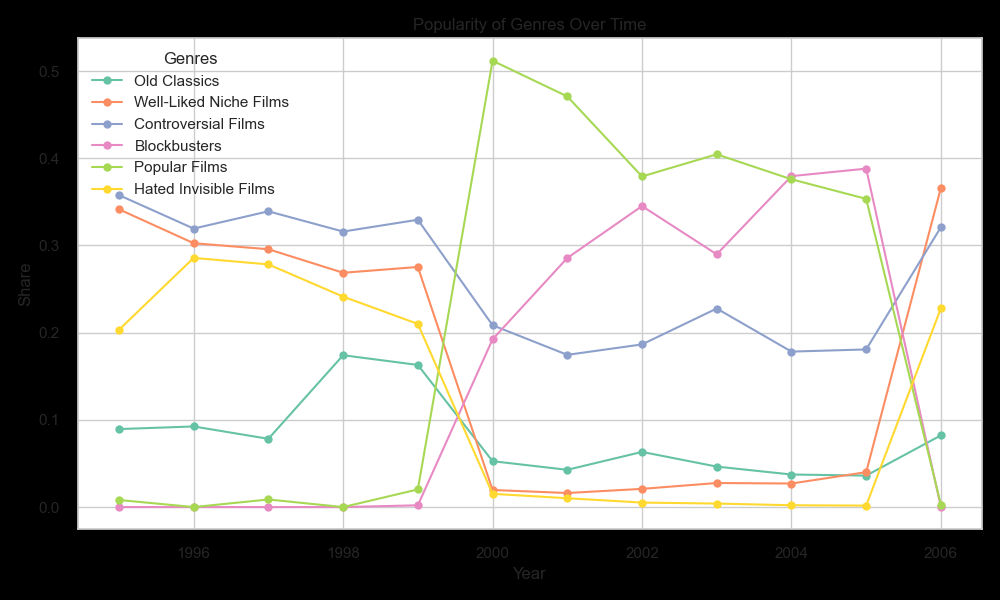

Yearly aggregation is chosen because it offers a clear, stable view of long-term patterns.

---

# 4. Results

This section represents the main findings of the project after computing every single section that has been mentioned before. The results summarize how different audience segments engage with different types of movies, how positively they rate them and how their viewing patterns change in scale and composition.

By combining the movie clusters and the user clusters with the full interaction history, we obtain a complete picture of the platform audience environment, revealing which users prefer which genres, which groups are most active and how taste patterns differ across segments.

## 4.1 Mapping of Users and Movies to Clusters

The result of the final table shows that every user and every movie could be successfully assigned to a cluster. The lookup tables produced two key results:

- 487,780 users were matched to one of the six user clusters derived  
- 16,013 movies were matched to one of the six behavioral pseudo-genres  

These values show that clustering coverage is almost complete: nearly the entire dataset of users and movies has a valid cluster label. This is important because later results can only be computed if every interaction can be mapped to both a user segment and a movie category.

This confirms that the system read the entire rating database in multiple chunks. This ensures that more than 4 million rating events were successfully merged with both types of cluster information, meaning that every rating knows which type of user produced it and every rating also knows which type of movie was rated.

(If needed, detailed cluster summaries can be referenced from  
[images/user_cluster_summary_kmeans.csv](images/user_cluster_summary_kmeans.csv) and  
[images/movie_cluster_summary.csv](images/movie_cluster_summary.csv).)

## 4.2 User–Movie Cluster Preference Matrix

The table summarizes how each user cluster interacts with each movie cluster by combining all rating events and computing both the total rating volume (`n_ratings`) and the average rating they assign (`avg_rating`). This gives a high-level view of preference strength and engagement patterns across clusters.

Table:

- [images/average_rating_user_movie_summary.csv](images/average_rating_user_movie_summary.csv)

The first rows show:

- **High rating volumes:** indicate strong exposure and engagement between certain user–movie cluster pairs.  
- **Average ratings remain consistently high:** suggesting that user clusters generally rate the movies they watch positively regardless of the specific pairing.  
- **The presence of lower volume combinations:** highlights niche interaction.  
- **Systematic preference patterns** across the matrix.

## 4.3 Preference Matrix: Average Ratings Across User and Movie Clusters

To understand how different audience segments engage with different types of movies, we constructed a preference matrix showing the average rating each user cluster assigns to each movie cluster.

This matrix is visualized as:

- **Average ratings heatmap:**  
  

(And the underlying table is in  
[images/average_rating_summary.csv](images/average_rating_summary.csv).)

Key patterns:

- **One-time Fan Visitors** show the strongest positive bias, giving the highest scores across almost every movie category. In the table, they rate Controversial Invisible Titles (4.65), Old Classics (4.49), and Well-Liked Movies (4.48) particularly high, indicating selective watching with consistently generous evaluations.  
- **Short-Term Users and Consistent Enjoyers** display moderate and stable ratings, generally in the 3.6–3.8 range for mainstream categories such as Well-Liked Movies and Blockbuster Hits. Their values show neither extreme liking nor disliking.  
- **One-Movie Critics** are the lowest-rating cluster, with noticeably depressed averages across all movie types. This is clear from values like 1.37 for Controversial Invisible Titles and 2.05 for Hated Niche Films, making them the most critical group in the matrix.  
- **Loyal Occasional Enjoyers** maintain balanced ratings, typically around 3.0–3.7 across categories. Their row shows no sharp jumps, suggesting broad but moderate appreciation.  
- **Heavy Enthusiasts**, despite being highly active, rate movies in a narrow mid-range band (roughly 3.2–3.7). Their table values reflect a consistent, neither overly positive nor negative rating style.

## 4.4 Number of Ratings Across Users and Movie Clusters

The table reports how many ratings each user cluster assigned to each movie cluster, showing how strongly different audience segments engage with various content types.

- **Table of counts:**  
  [images/number_ratings_summary.csv](images/number_ratings_summary.csv)

(Optionally, a corresponding bar/heat representation could be derived from these values.)

The results described:

- **Short-Term Users and Consistent Enjoyers** contribute the largest share of total ratings across nearly all movie clusters. For example, they generate 386,627 and 563,452 ratings respectively for Well-Liked Movies, and over 600,000 and 425,000 ratings for Blockbuster Hits. Their high counts indicate heavy engagement with mainstream and widely consumed content.  
- **Loyal Occasional Enjoyers** also show substantial activity, especially for Well-Liked Movies (253,493) and Blockbuster Hits (264,821), but at lower overall volumes compared to the more active clusters above.  
- **Heavy Enthusiasts** produce moderately high rating counts across most categories, such as 214,006 ratings for Well-Liked Movies, though their activity drops sharply for niche categories, with only 10 ratings for Unnoticed Films and 10 for Controversial Invisible Titles.  
- **One-time Fan Visitors** contribute significantly fewer ratings overall, consistent with their low-activity profile. They still participate meaningfully in Well-Liked Movies (85,057 ratings), but their engagement steeply declines for niche clusters like Controversial Invisible Titles (1,416) and Unnoticed Films (952).  
- **One-Movie Critics** are the least active cluster in the dataset. Their rating counts are extremely low across all movie types. For instance, they contribute only 3,358 ratings for Old Classics, 1,426 for Blockbuster Hits, and 26 for Unnoticed Films.

## 4.5 Share of Each Genre in Each User Segment’s Viewing

This table reports the proportion of each movie cluster within the viewing activity of each user cluster. It shows what types of movies each user segment actually spends their time watching, regardless of rating behavior.

- **Share table:**  
  [images/share_genre_in_user_segment.csv](images/share_genre_in_user_segment.csv)

- **Heatmap of viewing share (also EXP4):**  
  

The described results:

- **Well-Liked Movies** dominate viewing across all user clusters. The shares are highest here, with Heavy Enthusiasts at 0.533, Consistent Enjoyers at 0.485, and Loyal Occasional Enjoyers at 0.412. This indicates that all major user groups concentrate a significant portion of their viewing on mainstream, broadly appealing content.  
- **Blockbuster Hits** are another major viewing category, especially for segments with high activity. Short-Term Users (0.543), Consistent Enjoyers (0.366), and One-time Fan Visitors (0.578) all show strong engagement with this cluster. This confirms that high-traffic user groups gravitate toward widely promoted or high-visibility films.  
- **Hated Niche Films, Old Classics, and Unnoticed Films** represent very small portions of most users’ viewing patterns. For example, One-time Fan Visitors show only 0.042 of their viewing on Hated Niche Films and 0.004 on Unnoticed Films. Short-Term Users follow the same trend with 0.057 and 0.000, respectively. These low shares highlight that niche or less-publicized content is rarely consumed.  
- **Consistent Enjoyers and Heavy Enthusiasts** show slightly higher engagement with smaller genres. Heavy Enthusiasts, for example, have 0.149 of their viewing on Hated Niche Films and 0.115 on Old Classics, noticeably higher than most clusters. This suggests more exploratory behavior.  
- **One-Movie Critics** uniquely show their highest non-mainstream share in Hated Niche Films (0.171). Despite low overall activity, this cluster spends a relatively larger portion of their viewing on this more challenging or unpopular category.

